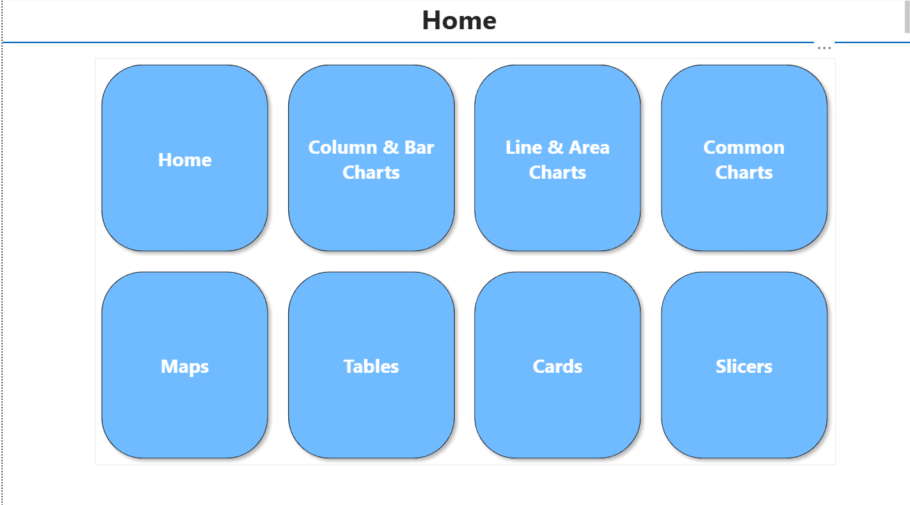
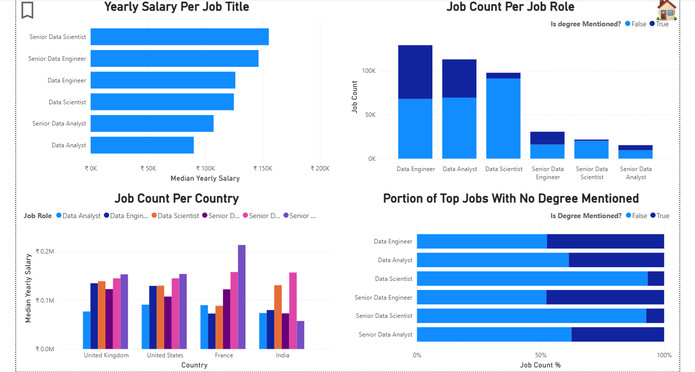
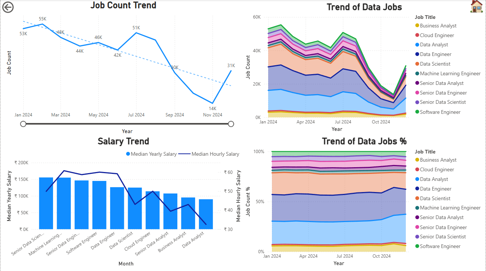
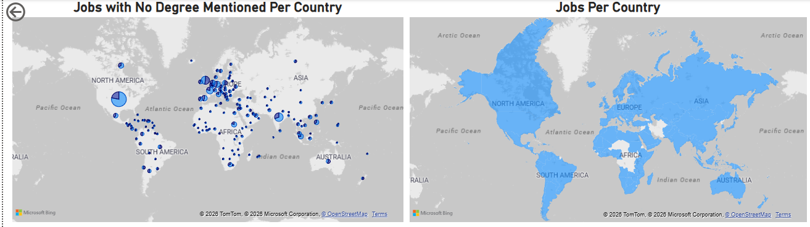
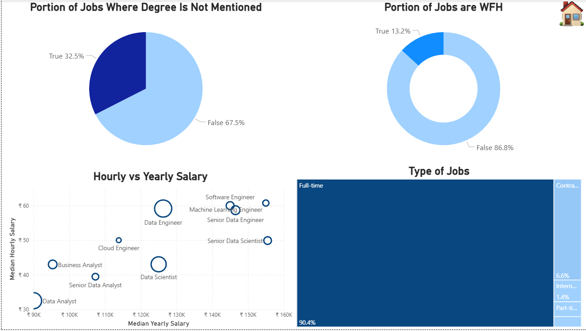
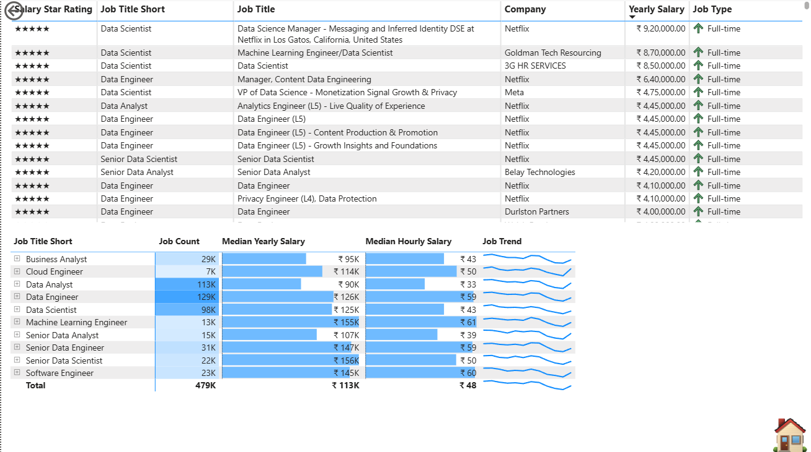
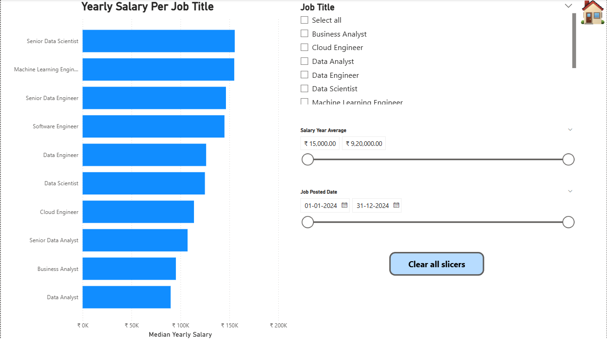

# Data Professional Global Salary & Job Market Analysis

## 🎯 Project Overview
This Power BI project provides a comprehensive analysis of the global job market for data professionals in 2024. The dashboard is designed to help job seekers and recruitment managers understand salary benchmarks, geographical job density, and the impact of educational requirements on compensation.

**Key Business Questions Addressed:**
* Which data roles command the highest median salaries globally?
* How does the "Degree Requirement" affect job availability across different roles?
* What is the trend of job postings throughout the year, and is the market growing or shrinking?
* Where are the primary geographic hubs for Data jobs?

## 📊 Dashboard Architecture & Navigation
The report features a custom-built **Navigation Hub** to ensure a seamless User Experience (UX):
* **Home Page:** A central landing area using tiled navigation buttons for intuitive access to different report sections (Maps, Trends, Tables, etc.).
* **Integrated Controls:** Every page includes a "Home" icon for quick navigation to home page **"Clear All Slicers"** button to allow users to quickly reset their search parameters.

## 🛠️ Technical Skills Demonstrated
### 1. Data Modeling & ETL
* **Star Schema Implementation:** Optimized the model for performance by separating Job Attributes (Dimensions) from Salary/Count metrics (Facts).
* **Data Cleaning:** Handled currency formatting and normalized job titles to ensure consistent categorization across different regions.

### 2. Advanced DAX & Analytics
* **Median vs. Average:** Utilized `MEDIANX` to provide a more accurate salary benchmark, avoiding the skewness caused by high-earning outliers.
* **Dynamic Trends:** Developed time-intelligence measures to track **Job Count Trends** and **Salary Volatility** month-over-month.
* **Portion Analysis:** Calculated the percentage of jobs offering Work From Home (WFH) options and those not requiring a degree using ratio-based DAX measures.

### 3. Visualization Strategy
* **Information Density:** Used **Sparklines** within the Matrix view to show historical trends alongside current metrics without cluttering the UI.
* **Geospatial Analysis:** Implemented **Bubble Map Clusters** to visualize job density across North America, Europe, and Asia.
* **Correlation Tracking:** Created a **Scatter Plot** to analyze the relationship between Hourly and Yearly salaries across different seniority levels.

## 📈 Key Insights
* **Seniority Premium:** Senior Data Scientists and Machine Learning Engineers represent the top tier of the salary bracket.
* **The "No-Degree" Opportunity:** Approximately **32.5%** of job postings do not explicitly mention a degree requirement, suggesting a shift toward skill-based hiring in specific technical roles.
* **Market Stability:** Despite seasonal fluctuations, Data Engineering remains one of the most stable roles in terms of total market share.
* **WFH Trends:** Remote work (WFH) remains a selective offering at **13.2%**, highlighting the current landscape of hybrid and on-site requirements.

## 🚀 How to Interact with the Report
1.  **Filtering:** Use the **Job Title** or **Date Range** slicers on the sidebar to narrow down specific markets.
2.  **Drill-Through:** Use the interactive visuals to filter the entire page by clicking on specific chart elements (e.g., clicking a specific Country on the map).
3.  **Reset:** Use the "Clear all slicers" button to return to the global view.

## 🔍 Page-by-Page Layout & Analysis

### 🏠 1. Home / Navigation Hub

**Purpose:** To provide a clean, uncluttered entry point for end user.

**Key Feature:** Custom-formatted Tile Buttons that use Page Navigation actions to guide the user to specific categories of insights (Maps, Trends, Tables, etc.).

---

### 📊 2. Yearly Salary & Job Role Analysis

**Purpose:** To identify which job titles are the most lucrative and how degree requirements impact those roles.

**Visuals:**
1. Bar Chart: Displays Median Yearly Salary by Job Title. Using "Median" instead of "Average" is a critical analytical choice to avoid outliers.
2. Stacked Column Chart: Shows Job Count per Job Role segmented by whether a degree is mentioned.
3. 100% Stacked Bar: Provides a "Portion" view of degree requirements, making it easy to see that "Senior Data Analyst" roles have a higher ratio of degree mentions than "Data Engineers."

---

### 📈 3. Trends & Time-Series

**Purpose:** To visualize how the market fluctuates over time.

**Visuals:**
1. Line Chart with Trendline: Shows the total Job Count Trend with a dotted forecast/trendline to visualize market direction.
2. Stacked Area Chart: Displays the "Trend of Data Jobs" to show how the volume of different roles (Data Analyst, Scientist, Engineer) changes relative to one another.
3. Combo Chart: Compares Median Yearly Salary (Bars) against Median Hourly Salary (Line) to spot discrepancies in compensation types.

---

### 🌍 4. Geospatial Job Mapping

**Purpose:** To answer "Where is the work?".

**Visuals:**
1. Bubble Map: Uses clustering to show job density. The size of the bubble represents the volume of jobs, while the pie-chart bubbles show the ratio of degree requirements within that specific city or region.
2. Filled Map: Highlights the specific countries active in the dataset, providing a high-level global footprint.

---

### 🔬 5. Job Type & Compensation Deep-Dive

**Purpose:** To find correlations and outliers in the data.

**Visuals:**
1. Scatter Plot: Analyzes the relationship between Hourly and Yearly pay. This is great for identifying which roles are typically "Contract" vs. "Full-time."
2. Treemap: Visualizes the "Type of Jobs" (Full-time, Contract, Part-time) to show the overwhelming dominance of full-time employment in this sector.
3. Donut Charts: High-level KPIs for WFH (Work From Home) status and Degree mentions.

---

### 📋 6. Matrix & Sparkline Master Table

**Purpose:** To allow users to see the specific companies and job titles behind the high-level charts.

**Key Feature:** A Matrix with Sparklines. This is a "Pro" feature in Power BI. It shows the current metrics (Salary, Count) while simultaneously showing the 12-month trend in a tiny, non-distracting line chart within the row.

---

### ⚙️ 7. Dynamic Slicer Engine

**Purpose:** To give the user "Surgical" control over the report.

**Key Feature:** Includes the "Clear All Slicers" button and advanced slicers like a "Numeric Range" for Salary and a "Date Slider".
